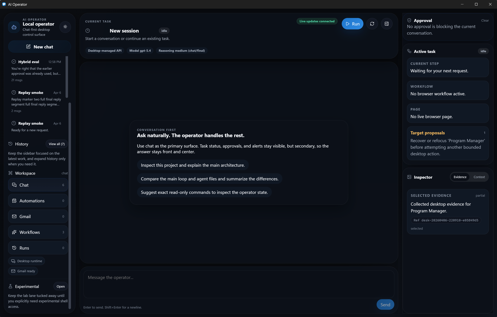

# AI Desktop Operator

A local AI desktop operator that can understand your system, take actions, and work through tasks step by step with controlled execution.

AI Desktop Operator is built to feel less like a chatbot and more like a careful operator. You can ask it to inspect the desktop, work through browser or system tasks, manage Gmail workflows, run automations, and pause for approval when something sensitive is about to happen. It stays local-first, keeps a clear run history, and tries to judge whether its actions actually worked instead of blindly assuming success.

## What it can do

- Work from chat while keeping task state, approvals, and context visible
- Inspect the desktop, windows, browser state, and recent evidence
- Run Gmail workflows such as inbox review, drafting, forwarding, and approval-gated sending
- Create and manage automations and watch-based tasks
- Use workflow skills and local extensions from the same command surface
- Keep replayable run history and explain what happened
- Learn from recent outcomes through short-horizon memory and retry logic
- Experiment with controlled shell access in a separate lab mode

## What makes it different

- **Local-first**: the main control surface is a local API with a thin desktop UI on top
- **Approval-gated**: sensitive actions pause instead of racing ahead
- **Bounded control**: this is designed to act carefully, not as reckless full-device automation
- **Evidence-based**: it uses screenshots, window state, and scene context to ground decisions
- **Adaptive**: it can evaluate outcomes, retry carefully, recover, and stop when progress is unclear
- **Built as an operator**: task lifecycle, replay, and state are first-class parts of the system

## How it works

The short version is:

**observe -> plan -> act -> evaluate -> adapt**

The operator gathers local context, decides on a bounded next step, executes it, checks whether it actually worked, and either continues, recovers, asks for approval, or stops. That loop is what makes the project more useful than a one-shot tool call and safer than a free-running automation agent.

## UI overview



The UI is chat-first, with workspaces for things like Automations, Gmail, Workflows, Runs, and experimental lab features. The main conversation stays in the center, approvals and active context stay visible on the right, and recent work stays compact in the left rail.

## Example use cases

- Open a file, inspect it, and send the result through Gmail with approval before the final send
- Check what is happening on the desktop and recover when the wrong window is focused
- Run a multi-step task that pauses for approvals instead of trying to do everything blindly
- Set up a recurring automation and review what happened later through replay and run history
- Test a safe shell task inside the experimental lab mode without mixing it into normal operator control

## Current status

The project already has a strong foundation and a real working product shape, but it is still evolving.

- The main desktop operator flow is usable and grounded in local state
- Gmail workflows, automations, replay, and workflow tooling are integrated
- Outcome evaluation, bounded recovery, and short-horizon memory are in place
- Experimental shell lab mode exists, but it should stay lab-only until it proves itself further

## Repository structure

- `core/` - operator runtime, control flow, evaluation, state, approvals, and API
- `desktop-ui/` - Tauri + React desktop interface
- `tools/` - tool implementations used by the operator
- `docs/` - deeper architecture notes and technical references

## Getting started

1. Install Python dependencies from the repo root:

   ```bash
   pip install -r requirements.txt
   ```

2. Install the desktop UI dependencies:

   ```bash
   cd desktop-ui
   npm install
   ```

3. Start the desktop app:

   ```bash
   npm run tauri:dev
   ```

If you want to inspect the backend directly, you can also run:

```bash
python main.py
```

## Learn more

The README is intentionally the simple entry point. Deeper technical material lives in [`docs/`](docs/).

Useful starting points:

- [Project overview](docs/PROJECT_OVERVIEW.md)
- [Desktop evidence architecture](docs/DESKTOP_EVIDENCE_ARCHITECTURE.md)
- [Desktop recovery model](docs/DESKTOP_RECOVERY_MODEL.md)
- [Desktop scene interpretation](docs/DESKTOP_SCENE_INTERPRETATION.md)
- [Gmail integration](docs/gmail-integration.md)
- [Roadmap](docs/ROADMAP.md)
